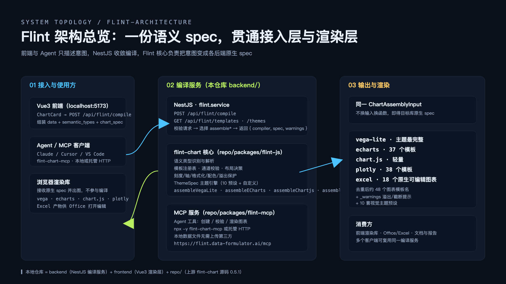
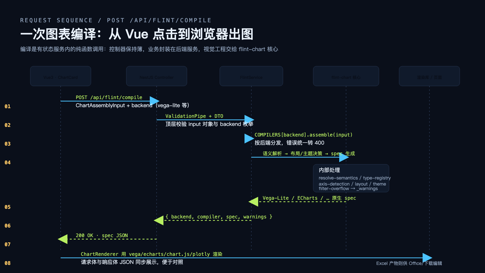
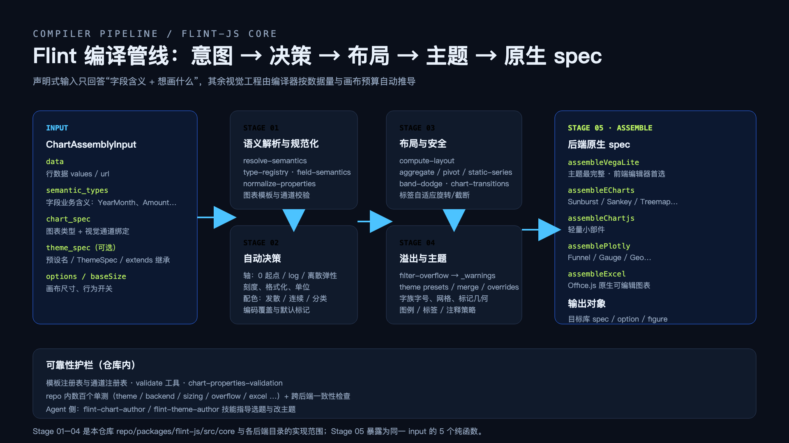
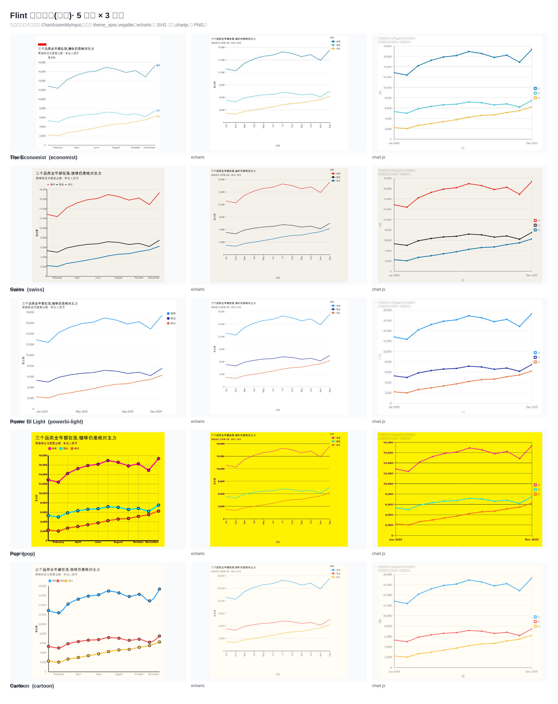
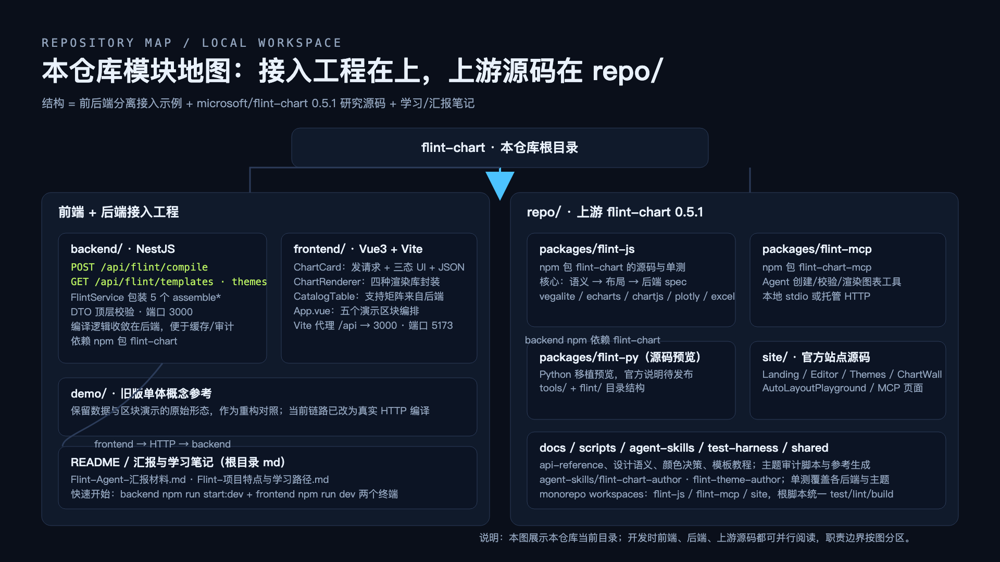
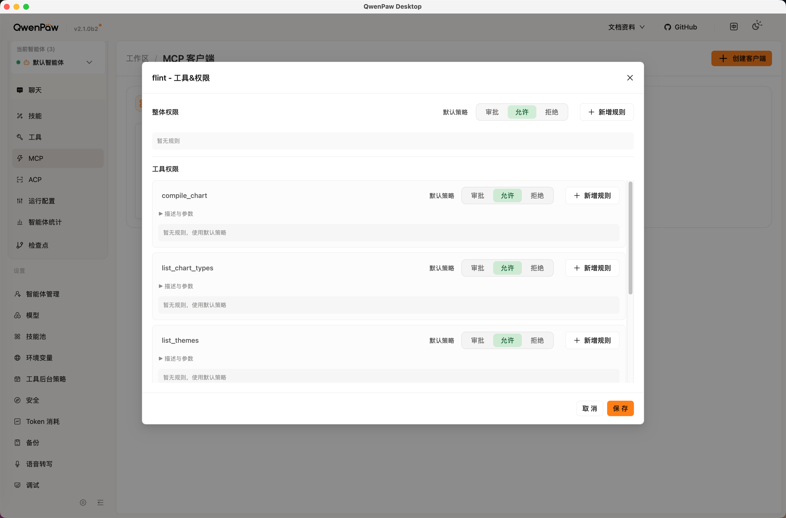
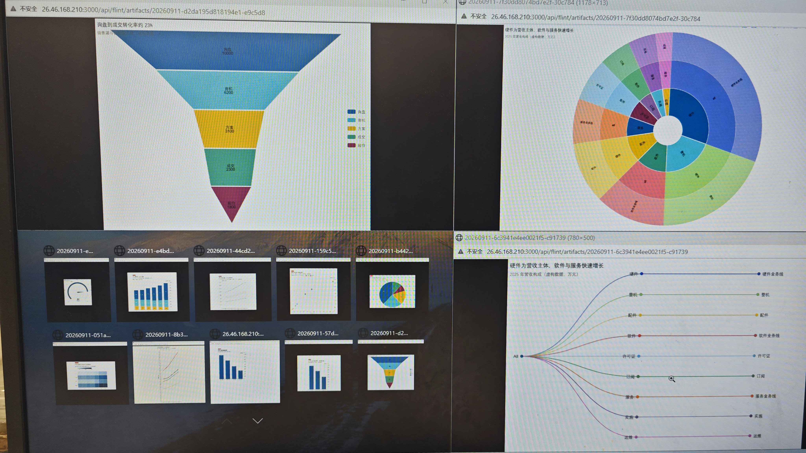

# Flint 后端(NestJS)

Flint 后端把一份**语义化图表描述**(`ChartAssemblyInput`)编译成 5 种图表库的原生 spec,
并把其中 3 种在服务端**无头渲染**成 SVG / PNG,通过 **REST** 和 **MCP** 两条通道交付给
前端页面与 Agent 平台。

一句话:**输入是"画什么"(数据 + 语义 + 图表意图),输出是"能直接看的图"或"可交付的产物链接"。**



> 图与可编辑源文件都在本目录 [`docs/`](./docs/)(系统拓扑 / 编译时序 / 编译管线 / 模块地图)。

---

## 能力一览

| 能力 | 说明 |
|---|---|
| 编译 | 5 个后端:`vega-lite` 36 模板 · `echarts` 37 · `chart.js` 22 · `plotly` 38 · `excel` 18 |
| 服务端渲染 | `vegalite`(Vega-Lite→Vega→SVG)· `echarts`(SSR→SVG)· `chartjs`(Canvas→PNG);PNG 统一由 resvg 光栅化 |
| 主题 | 10 套预设(nyt / economist / swiss / nature / mckinsey / datawrapper / powerbi / powerbi-light / pop / cartoon) |
| 产物交付 | 内联返回 或 产物 URL;存储支持本地磁盘(`fs`)与 S3/OSS/MinIO(`s3`);URL 带 HMAC 签名与 TTL |
| MCP | Streamable HTTP,5 个工具 + 3 个资源 + 2 个提示词,可直接接入 QwenPaw / Claude 等平台 |
| 配置 | `@nestjs/config` 自动加载 `.env.local` / `.env` |

---

## 快速开始

前置:Node.js ≥ 18(验证版本 22.x)。

```bash
cd backend
npm install

# 仓库里已带一份可用的 .env;也可从样例复制
cp .env.example .env

# 开发模式(watch)
npm run start:dev

# 生产模式
npm run build && npm run start:prod
```

启动后:

- REST:`http://localhost:3000/api`
- MCP(Streamable HTTP):`http://localhost:3000/mcp`
- 健康检查:`curl http://localhost:3000/api/health`

启动日志会打印当前生效的交付配置,便于确认 `.env` 是否被读取:

```text
Flint backend listening on http://localhost:3000/api
MCP (Streamable HTTP) endpoint: http://localhost:3000/mcp
Artifact delivery: url | store: fs(./output/artifacts) | ttl: 604800s | auth: off
```

---

## 配置(`.env`)

由 `@nestjs/config` 加载,优先级:**shell 环境变量 > `.env.local` > `.env`**。

| 变量 | 默认 | 说明 |
|---|---|---|
| `PORT` | `3000` | 服务端口 |
| `FLINT_ARTIFACT_STORE` | `fs` | 存储类型:`fs` 本地磁盘 / `s3` 对象存储 |
| `FLINT_ARTIFACT_DIR` | `./output/artifacts` | fs 模式的产物目录 |
| `FLINT_ARTIFACT_DELIVERY` | `inline` | `render_chart` / REST 未显式指定时的交付模式:`inline` / `url` / `both` |
| `FLINT_ARTIFACT_TTL_SECONDS` | `604800` | 产物有效期(秒),默认 7 天 |
| `FLINT_ARTIFACT_MAX_BYTES` | `16777216` | 单产物上限(16MiB) |
| `FLINT_PUBLIC_BASE_URL` | 空 | 对外 HTTPS 域名;反向代理/隧道部署时必填,否则用请求头推导 |
| `FLINT_MCP_AUTH_TOKEN` | 空 | 填写后 `/mcp` 要求 `Authorization: Bearer <token>`,产物 URL 走 HMAC 签名 |
| `S3_ENDPOINT` / `S3_REGION` / `S3_BUCKET` | 空 | `FLINT_ARTIFACT_STORE=s3` 时必填 |
| `S3_ACCESS_KEY_ID` / `S3_SECRET_ACCESS_KEY` | 空 | 对象存储凭证 |
| `S3_FORCE_PATH_STYLE` | `true` | MinIO / 阿里云 OSS 保持 true |
| `FLINT_ARTIFACT_S3_PREFIX` | `flint-artifacts` | 对象 key 前缀 |

完整样例见 [.env.example](./.env.example)。`s3` 配置缺失会在**启动时**直接报错。

---

## HTTP 接口

所有 REST 路由挂在全局前缀 `/api` 下;`/mcp` 不走该前缀。

| 方法 | 路径 | 说明 |
|---|---|---|
| GET | `/api/health` | 健康检查 |
| POST | `/api/flint/compile` | `{ input, backend }` → `{ backend, compiler, spec, warnings }` |
| POST | `/api/flint/render` | `{ input, backend, format?, scale?, background?, delivery?, artifactId?, overwrite? }` |
| GET | `/api/flint/artifacts/:id` | 取产物(Bearer 或 `?exp=&sig=` 签名;`?download=1` 强制附件下载) |
| GET | `/api/flint/templates?backend=` | 模板注册表(支持矩阵) |
| GET | `/api/flint/themes` | 主题清单(含 `supportedBackends`) |
| POST | `/mcp` | MCP Streamable HTTP(无状态,JSON-RPC over HTTP) |

后端命名两套写法都接受:`vegalite` / `vega-lite`、`chartjs` / `chart.js`。



### 渲染示例

```bash
# 1) 交付一个可下载的产物(默认 delivery=url)
curl -X POST http://localhost:3000/api/flint/render \
  -H 'content-type: application/json' \
  -d '{
    "backend": "echarts",
    "format": "png",
    "input": {
      "data": { "values": [{ "region": "华北", "revenue": 1284 }, { "region": "华东", "revenue": 976 }] },
      "semantic_types": { "region": "Category", "revenue": "Quantity" },
      "chart_spec": {
        "chartType": "Bar Chart",
        "title": "各区域收入对比",
        "encodings": { "x": { "field": "region" }, "y": { "field": "revenue" } },
        "baseSize": { "width": 480, "height": 300 }
      },
      "theme_spec": "economist"
    }
  }'
# → {"artifactId":"20260911-...","url":"http://localhost:3000/api/flint/artifacts/...?exp=...&sig=...",...}

# 2) 直接拿二进制(delivery=inline)
curl -X POST http://localhost:3000/api/flint/render \
  -H 'content-type: application/json' -o chart.svg \
  -d '{"backend":"vegalite","format":"svg","delivery":"inline","input":{...}}'
```

---

## MCP 接入

服务端内置 MCP Server(Streamable HTTP,无状态):每次 POST 新建实例,
不持有会话,天然可横向扩展。

| 工具 | 作用 |
|---|---|
| `render_chart` | 编译 + 渲染;`delivery=inline/url/both` 决定返回内联内容还是产物链接 |
| `compile_chart` | 只编译,返回后端原生 spec + warnings |
| `validate_chart` | 只校验,返回 valid / warnings / errors |
| `list_chart_types` | 列出模板与编码通道 |
| `list_themes` | 列出主题与适用后端 |

资源:`flint://agent-skill`(图表编写规范)、`flint://theme-skill`(主题规范)、
`flint://artifacts/{id}`(按 id 读回产物)。提示词:`author_flint_chart`、`author_flint_theme`。

以 QwenPaw 为例(智能体 → MCP → 新建):

```json
{
  "mcpServers": {
    "flint": {
      "transport": "streamable_http",
      "url": "http://localhost:3000/mcp"
    }
  }
}
```

平台在别的机器时把 `url` 换成可访问的地址;若配置了 `FLINT_MCP_AUTH_TOKEN`,
客户端需要带 `Authorization: Bearer <token>`。

---

## 渲染管线



1. **校验**:数据必须是内联 `data.values`(HTTP 服务不读服务器本地文件)、
   行数 ≤ 10 万、单元格必须是标量、`baseSize/canvasSize` 必须是 1–4000 的数字。
2. **规范化**:Waterfall 的 `total`/`合计` 自动归一化为 `end`;
   非 vegalite 后端收到 `theme_spec` 会做主题映射,无法解析则返回 `theme-unknown` warning。
3. **编译**:调用 `flint-chart` 的 `assemble*()`,拆出 `_warnings` / `_width` / `_height`。
4. **补齐**:ECharts / Chart.js 原本丢弃 `title` / `subtitle`,这里注入
   `option.title` 与 `options.plugins.title`。
5. **渲染**:Vega-Lite→Vega→SVG;ECharts SSR→SVG;Chart.js→PNG。
   `baseSize` 作为画布目标下限;输出与 PNG 倍率受 4000px 上限约束
   (越界返回 `output-clamped` / `scale-clamped` warning)。
6. **交付**:写入 artifact 服务(fs 或 s3),返回摘要 + 可下载 URL。

字体:`assets/fonts` 内置 Liberation Sans(与 Arial 度量一致)与 DejaVu,
中文按系统字体回退;文本测量用 `@napi-rs/canvas`,保证 SVG/PNG 与浏览器一致。

### 主题映射范围

| 后端 | 主题支持 |
|---|---|
| `vegalite` | 完整(布局 + 视觉,由 Flint 组装器实现) |
| `echarts` / `chartjs` | 视觉 token:系列调色板、画布背景、文字/网格/轴颜色、字体 |

主题 token 从 Flint 的 ThemeSpec 的 `ink` / `type` 中解析,
支持预设 id、`{ extends, ...覆盖 }` 与完全自定义三种写法。



> 完整图册(3 后端 × 10 主题)见 [../examples/theme-gallery/index.html](../examples/theme-gallery/index.html),
> 重新生成:`node scripts/generate-theme-gallery.js`。

---

## 目录结构



```text
src/
├── main.ts                       # 入口:全局前缀 /api、CORS、body 限制、挂载 /mcp、启动日志
├── app.module.ts                 # 根模块;ConfigModule 自动加载 .env
├── health.controller.ts          # GET /api/health
├── flint/
│   ├── flint.controller.ts       # 编译 / 模板 / 主题 路由
│   ├── render.controller.ts      # 渲染 / 产物下载 路由(挂载在 /api/flint)
│   ├── flint.service.ts          # 编译与渲染的业务入口(薄封装)
│   ├── flint.types.ts            # FlintBackend 定义与别名归一化
│   ├── dto/                      # class-validator 请求体校验
│   ├── render/
│   │   ├── render-core.ts        # 三个后端的无头渲染 + 尺寸/背景处理
│   │   ├── flint-assemble.ts     # 校验、编译、Waterfall/主题/标题规范化
│   │   ├── render.types.ts       # 后端枚举与安全上限
│   │   ├── theme.tokens.ts       # ThemeSpec → 设计 token
│   │   ├── theme-map.ts          # token → ECharts / Chart.js 注入
│   │   ├── render-fonts.ts       # 字体注册与 Vega 文本测量
│   │   └── esm-loader.ts         # 在 CJS 运行时加载 ESM 包(vega/vega-lite)
│   └── artifacts/
│       ├── artifact.service.ts   # 产物读写、id、过期、签名 URL
│       ├── artifact.store.ts     # fs / s3 两种存储适配器
│       ├── artifact.config.ts    # 环境变量解析
│       ├── artifact.types.ts     # 存储接口类型
│       └── public-url.ts         # 从请求头推导对外 base URL
├── mcp/
│   ├── mcp-http.ts               # Express Router 挂载 /mcp(stateless Streamable HTTP)
│   ├── mcp-server.ts             # 工具 / 资源 / 提示词注册
│   ├── mcp-schemas.ts            # 工具入参 zod schema(拍平的 ChartAssemblyInput)
│   └── mcp-constants.ts          # /mcp 路径与 body 上限
assets/
├── fonts/                        # Liberation / DejaVu 字体
└── skills/                       # agent 编写图表/主题的规范(MCP 资源)
skill-flint-chart/                # 可选的 agent skill(让 agent 把图直接贴进回复)
scripts/generate-theme-gallery.js # 生成 3 后端 × 10 主题对比图册
docs/
├── images/                       # README 用图:4 张架构图 + 主题对比图
└── diagrams/                     # 架构图的可编辑 HTML 源文件与截图脚本
```

---

## 常用命令

| 命令 | 说明 |
|---|---|
| `npm run start:dev` | 开发模式(watch) |
| `npm run build` | 编译到 `dist/` |
| `npm run start:prod` | 运行构建产物 |
| `npm run typecheck` | 类型检查 |
| `node scripts/generate-theme-gallery.js` | 生成主题对比图册 → `../examples/theme-gallery/` |

仓库级脚本(在仓库根执行):

| 命令 | 说明 |
|---|---|
| `../scripts/build-offline-win.sh` | 生成 Windows x64 离线部署包(含依赖体检) |
| `../scripts/build-offline-win.sh --verify <dir>` | 只体检某个目录的平台二进制/符号链接 |

---

## 验收自检

```bash
curl http://localhost:3000/api/health

# 原生模块可加载(渲染依赖)
node -e "require('@napi-rs/canvas'); console.log('canvas ok')"
node -e "require('@resvg/resvg-js'); console.log('resvg ok')"

# 编译(五后端)
curl -s -X POST http://localhost:3000/api/flint/compile \
  -H 'content-type: application/json' \
  -d '{"backend":"vega-lite","input":{"data":{"values":[{"c":"A","v":1}]},"semantic_types":{"c":"Category","v":"Quantity"},"chart_spec":{"chartType":"Bar Chart","encodings":{"x":{"field":"c"},"y":{"field":"v"}}}}}' | head -c 200

# 渲染 + 产物下载
curl -s -X POST http://localhost:3000/api/flint/render \
  -H 'content-type: application/json' \
  -d '{"backend":"chartjs","format":"png","input":{"data":{"values":[{"c":"A","v":1},{"c":"B","v":2}]},"semantic_types":{"c":"Category","v":"Quantity"},"chart_spec":{"chartType":"Bar Chart","encodings":{"x":{"field":"c"},"y":{"field":"v"}}}}}'

# MCP 工具面
curl -s -X POST http://localhost:3000/mcp \
  -H 'content-type: application/json' -H 'accept: application/json, text/event-stream' \
  -d '{"jsonrpc":"2.0","id":1,"method":"tools/list","params":{}}'
```

---

## 部署

**单机 / 生产**

```bash
npm run build && npm run start:prod
```

- 反向代理需透传 `x-forwarded-proto` / `x-forwarded-host`,否则产物 URL 会指向内网地址;
- 生产建议配置 `FLINT_PUBLIC_BASE_URL`(HTTPS)与 `FLINT_MCP_AUTH_TOKEN`;
- 多副本部署请把 `FLINT_ARTIFACT_STORE` 设为 `s3`,不要依赖本地磁盘。

---

## 常见问题

| 现象 | 原因 / 处理 |
|---|---|
| `.env` 改了不生效 | 配置在进程启动时读取,改完需重启后端 |
| `/mcp` 返回 401 | 配置了 `FLINT_MCP_AUTH_TOKEN`,请求需带 `Authorization: Bearer <token>` |
| 产物链接 401 / 404 | 签名过期或产物已过 TTL;重新渲染即可 |
| `Cannot find module '@napi-rs/canvas-...'` | 依赖不完整或是别的平台版本;重新 `npm ci`(离线包见部署手册) |
| `chartjs` 渲染报错、其他后端正常 | 同上,缺 `@napi-rs/canvas` 平台包 |
| 启动报 `EADDRINUSE` | 端口被占用,改 `.env` 的 `PORT` |
| `theme_spec` 没生效 | 检查是否传了未知主题(会返回 `theme-unknown` warning);echarts/chartjs 只映射视觉 token |
| Waterfall 合计柱浮高 | 用 `end`,或用 `total/合计`(服务端会自动归一化并给出提示) |

---

## 已知边界

- 服务端渲染仅支持 `vegalite` / `echarts` / `chartjs`;`plotly` / `excel` 只能编译,需要在客户端/Excel 侧渲染;
- `chartjs` 没有 SVG 输出,只能 PNG;
- ECharts 的 SVG 每次渲染带随机类名(字节不确定),PNG 是确定的;
- 主题只映射视觉 token,布局/几何仍由各后端自己的布局引擎决定。

---


## 接入qwenpaw





